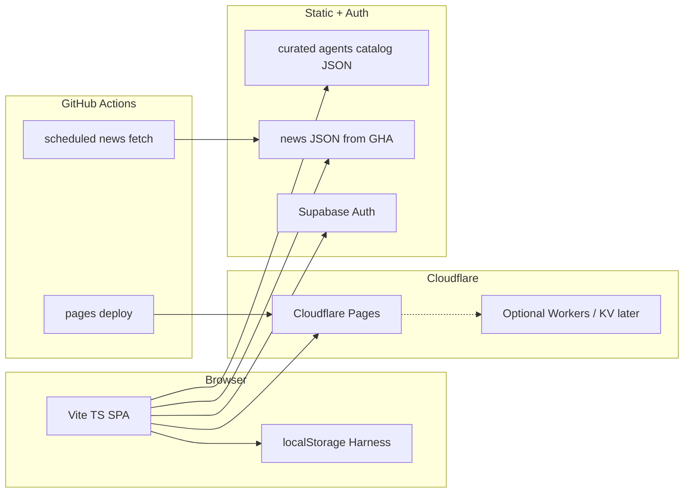

# Agenter

**for better agents**

Intended live site: [https://agenter.si](https://agenter.si) (DNS / Pages binding TBD).

Agenter.si helps AI users **filter, compare, and pick** the right AI or agent product across CN, US, and global catalogs—plus a light scheduled AI news digest and minimal login. This README is the **canonical English build brief**: future agents should be able to implement the product from this text, sibling repos, and linked public docs alone.

---

## Why Agenter.si

**SI** in the `.si` TLD stands for **Super Intelligence**—the naming shift around AI capability and products. Agenter sits on that signal without claiming to *be* SI.

The brand is for people who already use AI tools and agents but struggle with **selection**: too many models, wrappers, and “agents”; opaque pricing and context windows; CN vs US vs global availability; and marketing pages that do not compare apples to apples. Agenter’s job is honest comparison and a small news pulse—not another agent runtime.

---

## Locked decisions

| Topic | Decision |
|-------|----------|
| Domain / brand | **Agenter.si**; tagline **for better agents**; `.si` → Super Intelligence |
| Core job | Help AI users **filter, compare, and pick** the right AI/agent (CN / US / global) |
| Secondary | **AI news digest** via scheduled fetch (not third-party news APIs as primary) |
| Harness | Custom **dimensions + weights** only; **no** local agent orchestration |
| Locales | **zh** and **en** only |
| First screen | Side-by-side **comparison table** (core); light scene tags above the table |
| MVP order | (1) curated compare + Harness → (2) news pipeline → (3) minimal login |
| Stack | **Cloudflare Pages** (+ optional Workers/KV later) + **Supabase Auth**; lean **Vite + TypeScript** SPA |
| Simplicity | Explicitly **anti-Let-us-bloat**: three surfaces, no IELTS-scale portals |

**Defaults (no further product Q&A required for MVP scaffolding):**

- Curated seed catalog of **~8–15** agents/products as in-repo JSON until a CMS is justified.
- News job may start with **`LLM_MODE=off`** (title + excerpt digest is enough).
- Auth first method: **email magic link** via Supabase.

---

## Product principles

1. **Start small.** Ship three surfaces only: Compare, News, Auth. Resist portal sprawl.
2. **Distill boldly.** Copy *patterns and invariants* from OpenCool and Let us IELTS—not their product surfaces, Soft Soft layers, trading UI, or admin control planes.
3. **Simple UI.** First viewport is a comparison table users can read immediately. Scene tags are light filters, not a directory product.
4. **Harness boundary (hard).** Users customize comparison dimensions and weights. Nothing that schedules, orchestrates, or “runs agents for you.”
5. **No agent runtime marketplace.** Agenter is a selection surface, not a place to host or execute third-party agents.

---

## Surfaces (MVP)

Ship in this order: **Compare → News → Login**.

### 1. Compare (core)

**User story:** As an AI user choosing a model or agent product, I want a side-by-side table of curated options (CN / US / global) with clear parameters and light scene filters, so I can shortlist without opening ten marketing sites.

**Acceptance bar:**

- First screen is a **side-by-side comparison table** (not a card grid of directories).
- Light **scene tags** sit above the table and filter rows/columns without becoming a full directory UX.
- Catalog is **curated JSON** in-repo (~8–15 seed records); columns cover identity, region, pricing/context/capability-style fields, and links.
- **Harness** can add/remove dimensions and adjust weights; weighted sort or highlight respects those prefs (localStorage first).
- Works on desktop and mobile (horizontal scroll OK for wide tables; no broken layout).

### 2. News

**User story:** As a returning visitor, I want a short AI/SI-related digest from a scheduled fetch pipeline, so I stay oriented without treating Agenter as a news portal.

**Acceptance bar:**

- News is **secondary** to Compare; linked from nav, not the hero product.
- Content comes from a **scheduled job** (GitHub Actions) that fetches configured sources and writes **static JSON** (and optionally a small HTML fragment) consumed by the SPA—not a live third-party news API as the primary path.
- `LLM_MODE=off` is acceptable for MVP (titles, links, short excerpts).
- Per-source failures are **non-fatal**; the site still builds if one feed fails.

### 3. Auth

**User story:** As a user who wants prefs to follow me, I want a minimal login so Harness weights (and later shortlists) can sync—without a full account product.

**Acceptance bar:**

- Supabase Auth with **email magic link** as the first method.
- Logged-out users still get full Compare + News; auth is optional enhancement.
- No admin console, no Soft Soft / IELTS feature surface, no social graph.

---

## Harness (Honest / thin)

**In scope:**

- User-defined **comparison dimensions** (e.g. price, context window, latency band, CN availability, open weights).
- **Weights** per dimension for sort / highlight.
- Persistence: **localStorage** first; optional sync after Auth lands.

**Out of scope (hard):**

- Local agent orchestration, autonomous scheduling, “arrange agents for me.”
- Running user prompts against catalog models inside Agenter.
- Marketplace install / runtime of third-party agents.

The name is intentionally thin: **comparison customization only**.

---

## i18n

- Locales: **`zh`** and **`en`** only. Do not add a third language in MVP.
- Default locale from browser language / `Accept-Language`, with a **manual toggle** in the UI.
- All UI strings go through a small dictionary (pair every key in zh and en at add time).
- Catalog and news content may be bilingual fields or locale-picked fields; keep the schema consistent.

---

## Architecture (target)

Lean static-first SPA on Cloudflare Pages, auth via Supabase, news via scheduled CI writing static artifacts, compare data from curated JSON.



**Stack notes:**

| Layer | Choice |
|-------|--------|
| App | Vite + TypeScript SPA (lean; not Vue/Nuxt Let-us scale unless justified later) |
| Hosting | Cloudflare Pages; optional Workers/KV only when a clear need appears |
| Auth | Supabase Auth (magic link first) |
| Compare data | In-repo curated JSON (e.g. `data/agents.json`) |
| News | GHA cron → fetch sources → commit or artifact → static JSON under `public/` or `data/` |
| Deploy | `wrangler pages deploy` pattern (see Let us workflow), project name TBD (`agenter`) |

---

## Implementation roadmap

Agents should land each phase as a **PR-sized** change against `main`.

### Phase 0 — Bootstrap

- Scaffold Vite + TypeScript SPA in this repo.
- Add Cloudflare Pages project wiring (`wrangler.toml` pages output dir, `.github/workflows` deploy).
- `.env.example` for public Supabase URL/anon key (no secrets committed).
- Minimal shell: nav placeholders for Compare / News / Auth, zh/en toggle stub.
- README remains canonical; do not invent parallel product docs.

### Phase 1 — Compare + Harness

- Seed `data/agents.json` (~8–15 curated records).
- First screen: side-by-side comparison table + light scene tags above.
- Harness UI: edit dimensions + weights; persist to `localStorage`.
- Weighted sort / highlight; empty-state and mobile scroll behavior.
- No backend required.

### Phase 2 — News (OpenCool patterns)

- Add a thin news pipeline distilled from OpenCool invariants (see sibling distill below).
- `sources.config.json` (or equivalent) as registry; per-source try/catch; locale filter zh/en.
- Scripts: dry-run (fetch only) + scheduled daily/publish that writes static JSON for the SPA.
- GHA schedule; `LLM_MODE=off` OK.
- Do **not** port A-share / trading UI or full daily-brief HTML report chrome.

### Phase 3 — Auth (Let us patterns)

- Distill Supabase client + session handling from Let us (paths below)—**auth only**.
- Email magic link; protect nothing essential behind login.
- Optional: sync Harness prefs to a minimal user table (RLS) after session works.
- Do **not** port Soft Soft, packages, admin, or Let-us IA.

### Phase 4 — DNS + launch

- Bind **agenter.si** on Cloudflare (Pages custom domain).
- Polish copy, empty states, OG basics; verify zh/en.
- Launch checklist: seed catalog reviewed, news job green, auth magic link tested in staging.

---

## Distill from sibling repos

Copy **invariants and deploy/auth/news patterns** only. Do not clone product bloat.

### OpenCool — [`fudan2026/opencool`](https://github.com/fudan2026/opencool)

Use for the **scheduled news / fetch** path.

| Path / command | Why |
|----------------|-----|
| [`AGENTS.md`](https://github.com/fudan2026/opencool/blob/main/AGENTS.md) | Operational invariants (config registry, non-fatal fetches, locale, no web framework) |
| [`sources.config.json`](https://github.com/fudan2026/opencool/blob/main/sources.config.json) | Single source of truth for source registry shape |
| [`scripts/daily.ts`](https://github.com/fudan2026/opencool/blob/main/scripts/daily.ts) | Pipeline orchestration; per-source try/catch |
| [`lib/sources/`](https://github.com/fudan2026/opencool/tree/main/lib/sources) | Fetcher dispatch, RSS/API modules, registry loader |
| `npm run dry-run` | Fetch-only validation (~30s, no LLM) |
| `npm run daily` | Full pipeline reference (Agenter news may stay LLM-off) |
| `npm run build-site` | Static site generation pattern for published artifacts |

**Upstream fork note:** [`leiting-eric/DailyBrief`](https://github.com/leiting-eric/DailyBrief) — historical upstream of the daily-brief lineage; consult for OSS context, not as Agenter’s product UI.

**Copy:** config-as-registry, non-fatal per-source errors, locale filtering, curl/JSON-light fetching, static publish.

**Do not copy:** A-share / trading section, full multi-tab digest chrome, Playwright/Puppeteer, hardcoded source lists in TS.

### Let us IELTS — [`fudan2026/letus-ielts`](https://github.com/fudan2026/letus-ielts)

Use for **Supabase Auth + Cloudflare Pages deploy** only.

| Path | Why |
|------|-----|
| [`src/composables/supabaseClient.js`](https://github.com/fudan2026/letus-ielts/blob/master/src/composables/supabaseClient.js) | Client init, ready flag, env-driven URL/anon key |
| [`src/composables/userStore.js`](https://github.com/fudan2026/letus-ielts/blob/master/src/composables/userStore.js) | Auth session patterns only—strip IELTS profile/product concerns |
| [`wrangler.toml`](https://github.com/fudan2026/letus-ielts/blob/master/wrangler.toml) | Pages project name + `pages_build_output_dir` pattern (omit Let-us KV unless Agenter later needs analytics) |
| [`.github/workflows/cloudflare.yml`](https://github.com/fudan2026/letus-ielts/blob/master/.github/workflows/cloudflare.yml) | `wrangler pages deploy` CI shape |

**Copy:** magic-link-capable Supabase client, session restore, Pages deploy workflow.

**Do not copy:** Soft Soft / Soft羽 / packages / admin control plane, IELTS content, portal carousels, Harness-as-commute-scheduler metaphors from Let us (Agenter Harness is comparison weights only).

---

## External distill targets

UX and field dictionaries—prefer public product pages and OSS mirrors. Do not scrape behind logins or automate browsers for pre-launch understanding.

| Target | Distill |
|--------|---------|
| **Apple** product compare | Table density, clarity, restrained column sets |
| **OpenRouter** models UI (+ related public repos) | Pricing / context / capability columns |
| **Artificial Analysis** | Benchmark, speed, price presentation |
| **G2 / Capterra** | Funnel only: filter → shortlist → compare (not review-site chrome) |
| **There's An AI For That / Futurepedia** | Restrained scene tags—not directory bloat |
| **LMSYS / LMArena** | Arena-style metric vocabulary |
| **Hugging Face Open LLM Leaderboard** (+ GitHub [`open-llm-leaderboard`](https://github.com/huggingface/open-llm-leaderboard) where applicable) | Open metric names and leaderboard fields |
| Optional: **DailyBrief** upstream | Same as OpenCool lineage note above |

When new Origin-mirrored compare/catalog tools are adopted later, document their URLs here.

---

## Data model (v1 sketch)

Types are illustrative; keep JSON serializable for static hosting.

### Agent / product record

```ts
type AgentRecord = {
  id: string;                 // stable slug
  name: string;
  nameZh?: string;
  vendor?: string;
  regions: Array<"CN" | "US" | "global" | string>;
  category: "model" | "agent" | "wrapper" | "tool" | string;
  sceneTags: string[];        // light filters above the table
  pricing?: {
    summary: string;          // short human label
    inputPerMTok?: number;
    outputPerMTok?: number;
    currency?: string;
    url?: string;
  };
  contextWindow?: number;     // tokens, if known
  capabilities?: string[];    // e.g. tools, vision, reasoning
  openWeights?: boolean;
  websiteUrl?: string;
  docsUrl?: string;
  notes?: string;
  updatedAt: string;          // ISO date
};
```

### Compare dimensions

```ts
type DimensionId = string;    // e.g. "price", "context", "cn_access"

type DimensionDef = {
  id: DimensionId;
  labelEn: string;
  labelZh: string;
  // How to read a cell from AgentRecord—implementation-defined accessor key
  field: string;
  higherIsBetter?: boolean;
};
```

Built-in dimensions ship with the app; Harness may add custom dimension ids that map to numeric or enum fields when present.

### News item

```ts
type NewsItem = {
  id: string;
  title: string;
  titleZh?: string;
  url: string;
  sourceId: string;
  publishedAt?: string;
  excerpt?: string;
  locale?: "zh" | "en" | "any";
};
```

### Harness preferences

```ts
type HarnessPrefs = {
  version: 1;
  dimensions: DimensionDef[];     // active set (built-in + user)
  weights: Record<DimensionId, number>; // typically 0–1 or 0–100; normalize in UI
  sceneTagFilter?: string[];      // optional active tags
  locale?: "zh" | "en";
};
```

Persist `HarnessPrefs` in `localStorage` under a namespaced key (e.g. `agenter.harness.v1`). After Auth, optional sync to Supabase `user_data`-style JSON with RLS.

---

## Non-goals

- Multi-agent **runtime** / orchestration / “arrange agents for me”
- Extra locales beyond **zh / en**
- News-API-first architecture (scheduled fetch of configured sources is primary)
- Playwright / Puppeteer fetchers
- Let-us-scale information architecture, Soft Soft product layers, admin consoles
- Agent marketplace, paid listings, or in-app model execution in MVP
- Trading / A-share / finance dashboard chrome from OpenCool

---

## Agent operating notes

1. **English README is canonical.** Product decisions live here; sync high-level changes to Project Context when the Project store is in use.
2. **No Computer Use required pre-launch.** Implement from this README, sibling repos, and public docs/GitHub. Do not depend on browser automation to learn the product before the site exists.
3. **PR-sized phases.** Prefer Phase 0→4 as separate PRs; keep diffs reviewable.
4. **No secrets in git.** Use `.env.example` + CI secrets (`CF_API_TOKEN`, `CF_ACCOUNT_ID`, Supabase keys).
5. **Anti-bloat check.** Before adding a surface, ask: does it serve Compare, News, or Auth? If not, defer.
6. **Sibling edits.** Do not modify OpenCool or Let us unless a separate task explicitly requires it; distill into `agenter` instead.

---

## License / status

**Status:** greenfield. The site is **not built yet**; this repository currently holds the brand stub and this **build brief**.

License: TBD by maintainers (add a `LICENSE` when chosen). Until then, treat the repo as private/unlicensed source for the Agenter.si project.

---

## Quick links

| Resource | URL |
|----------|-----|
| Intended domain | https://agenter.si |
| This repo | https://github.com/fudan2026/agenter |
| OpenCool (news patterns) | https://github.com/fudan2026/opencool |
| Let us IELTS (auth + Pages) | https://github.com/fudan2026/letus-ielts |
| DailyBrief upstream | https://github.com/leiting-eric/DailyBrief |
| HF Open LLM Leaderboard (GitHub) | https://github.com/huggingface/open-llm-leaderboard |
