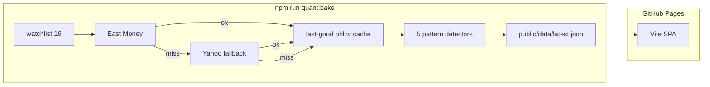

# Agenter

**for better agents**

Live Quant demo (GitHub Pages): [https://fudan2026.github.io/Agenter/](https://fudan2026.github.io/Agenter/)

Intended custom domain: [https://agenter.si](https://agenter.si) (Cloudflare DNS binding is **not** this round).

Agenter helps AI users **filter, compare, and pick** the right AI or agent product—plus a light news digest and minimal login on the roadmap. **This repository’s live MVP is a Quant review demo** that shows agent capability on A-share / CN ETF candle patterns. Agents / News / Auth remain documented as future surfaces, not current nav.

This README is the **canonical English build brief**.

---

## Live MVP (this round): Quant review

| Item | Value |
|------|-------|
| Site title ZH | **Agent 能力演示：量化复盘** |
| Site title EN | **Agent capability demo: quant review** |
| Hosting | GitHub Pages from `main` (Actions → Pages; zero custom secrets) |
| Markets | CN A-share + CN ETF (`.SS` / `.SZ`) — **16** symbols |
| Patterns | Exactly **5** (see below) |
| Data | East Money kline primary → Yahoo chart fallback → last-good cache |
| UI | Vanilla Vite + TypeScript SPA; hash routes `#/` and `#/asset/:symbol` |

### Commands

```bash
npm ci
npm test                 # pattern unit tests (incl. no-lookahead)
npm run quant:bake       # fetch OHLC → public/data/latest.json (gate: ok+stale ≥ 8)
npm run build            # vite build → dist/
npm run dev              # local preview
```

Bake success gate: `symbolsOk + symbolsStale ≥ 8`, else exit code 1. A fixture `public/data/latest.json` is committed so offline `vite build` works; CI refreshes it when network allows.

### Five patterns (fixed IDs)

| patternId | EN | ZH | Bars | Direction |
|-----------|----|----|------|-----------|
| `bullish_engulfing` | Bullish engulfing | 看涨吞没 | 2 | bull |
| `bearish_engulfing` | Bearish engulfing | 看跌吞没 | 2 | bear |
| `hammer` | Hammer | 锤子线 | 1 | bull |
| `shooting_star` | Shooting star | 射击之星 | 1 | bear |
| `doji` | Doji | 十字星 | 1 | neutral |

**Formulas**

1. **bullish_engulfing** — prior bearish (`close[i-1] < open[i-1]`), current bullish (`close[i] > open[i]`), `open[i] ≤ close[i-1]` and `close[i] ≥ open[i-1]`.
2. **bearish_engulfing** — mirror of above.
3. **hammer** — not a doji; lower wick ≥ 2× body; upper wick ≤ body.
4. **shooting_star** — not a doji; upper wick ≥ 2× body; lower wick ≤ body.
5. **doji** — `body / (high-low) ≤ 0.1` when `high > low`; if `high === low`, treat as doji.

**No-lookahead:** pattern ending at bar `i` uses only candles `≤ i` (unit-tested).

Recent hits shown in UI: last **60** trading days only.

### Watchlist (16)

Macro: `000001.SS`, `399001.SZ`  
ETF: `510300.SS`, `510500.SS`, `159915.SZ`, `588000.SS`, `512880.SS`, `512480.SS`  
A-share: `600519.SS`, `600036.SS`, `000858.SZ`, `002594.SZ`, `601012.SS`, `000001.SZ`, `600276.SS`, `601888.SS`

### Architecture



The browser never calls East Money / Yahoo. The SPA only reads baked JSON.

---

## Why Agenter.si

**SI** in the `.si` TLD stands for **Super Intelligence**. Agenter sits on that signal without claiming to *be* SI.

Long-term product job: honest agent/product **comparison** and a small news pulse—not another agent runtime. The Quant Pages demo proves the repo can ship a useful, static, zero-secret capability surface first.

---

## Locked decisions

| Topic | Decision |
|-------|----------|
| Domain / brand | **Agenter.si**; tagline **for better agents** |
| Live MVP | Quant review demo on GitHub Pages (`/Agenter/` base) |
| Locales | **zh** and **en** only |
| Nav (this round) | Quant demo only — **no** Agents / News / Login links |
| Stack (this round) | Vite + TypeScript vanilla SPA + GitHub Pages |
| Roadmap | Agents compare → news digest → minimal Supabase login → Cloudflare custom domain |

---

## Roadmap (NOT this round — see also NOT list)

Ship later as separate PRs:

1. **Compare + Harness** — curated agent/product table, dimensions + weights (`localStorage`).
2. **News** — scheduled fetch → static JSON (OpenCool invariants; `LLM_MODE=off` OK).
3. **Auth** — Supabase magic link (optional prefs sync).
4. **DNS** — bind `agenter.si` on Cloudflare Pages/DNS.

---

## Distill sources

### OpenCool — [`fudan2026/opencool`](https://github.com/fudan2026/opencool)

Copied minimally for OHLC bake:

| Source | Into Agenter |
|--------|----------------|
| `lib/trading/eastmoney-kline.ts` | `src/lib/ohlc/eastmoney-kline.ts` |
| `lib/trading/yahoo.ts` | `src/lib/ohlc/yahoo.ts` |
| `lib/trading/ohlcv-cache.ts` | `src/lib/ohlc/ohlcv-cache.ts` |
| `lib/trading/runner.ts` | `src/lib/ohlc/runner.ts` (CN only, concurrency 4) |
| `lib/trading/watchlist.ts` | names for the 16 symbols only |

Upstream lineage note: [`leiting-eric/DailyBrief`](https://github.com/leiting-eric/DailyBrief).

### External

| Target | Use |
|--------|-----|
| [cm45t3r/candlestick](https://github.com/cm45t3r/candlestick) | Optional reference; Agenter implements the 5 formulas directly |
| [michaelsboost/CandleEdge](https://github.com/michaelsboost/CandleEdge) | UX cue: detail + `lightweight-charts` |
| Let us [cloudflare.yml](https://github.com/fudan2026/letus-ielts/blob/master/.github/workflows/cloudflare.yml) | Deploy hygiene → rewritten as GitHub Pages workflow (no `CF_API_TOKEN`) |

---

## NOT this round (hard stop)

- Huachuang / 看线宝 / xingtai.pro / mark.hcquant.com / morphology SaaS tokens
- HK / US / crypto symbols on the watchlist
- 10-year backtest reports; win-rate filter UI; pattern “盈亏比” tables
- ETF rotation / strategy comparison
- Supabase / magic-link login; Cloudflare DNS for `agenter.si`
- Agents compare product; news digest; dual empty nav
- Playwright / Puppeteer; paid LLM in CI; THS / live orders
- Porting Let-us Soft Soft / admin / packages
- Expanding beyond **5** patterns or **16** symbols
- Claiming feature parity with 看线宝

---

## Dependency allowlist

**Allowed:** `vite`, `typescript`, `tsx`, `@types/node`, `lightweight-charts`  
**Forbidden this round:** Supabase, wrangler, Playwright, Puppeteer, OpenAI/Anthropic SDKs, eastmoney-data-sdk, technicalindicators mega-libs, Huachuang clients

---

## Agent operating notes

1. English README is canonical for product intent; Quant MVP is the live surface.
2. No Computer Use required to verify — use `npm test`, bake logs, and curl/HTML of Pages.
3. No secrets in git. Pages workflow uses default `GITHUB_TOKEN` only.
4. Do not modify OpenCool or Let us unless a separate task says so; distill into `agenter`.

---

## License / status

**Status:** Quant Pages MVP on GitHub Pages. Agents/News/Auth are roadmap.

License: TBD by maintainers.

---

## Quick links

| Resource | URL |
|----------|-----|
| Live Pages | https://fudan2026.github.io/Agenter/ |
| Intended domain | https://agenter.si |
| This repo | https://github.com/Fudan2026/Agenter |
| OpenCool (OHLC distill) | https://github.com/fudan2026/opencool |
| Let us IELTS (deploy hygiene) | https://github.com/fudan2026/letus-ielts |
| DailyBrief upstream | https://github.com/leiting-eric/DailyBrief |
